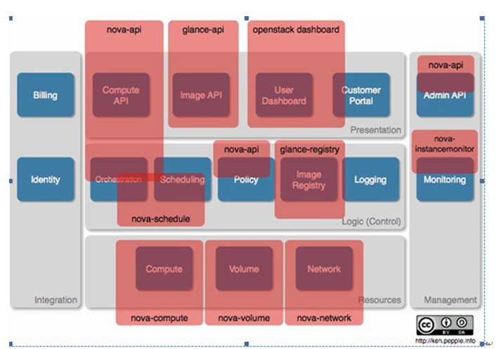

<!-- MarkdownTOC -->

# OpenStack基本介绍
OpenStack项目是一个开源的云计算平台，旨在实现很简单,大规模可伸缩,功能丰富。来自世界各地云计算开发人员和技术人员共同创建OpenStack项目。OpenStack通过一组相关的服务提供一个基础设施即服务(IaaS)解决方案。每个服务提供了一个应用程序编程接口(API),促进了这种集成。根据需要,你可以安装部分或全部服务。

# Nova基本介绍
Nova是OpenStack云中的**计算组织控制器**。支持OpenStack云中实例（instances）生命周期的所有活动都由Nova处理。这样使得Nova成为一个负责管理计算资源、网络、认证、所需可扩展性的平台。
* 功能和特点
  * 实例生命周期管理
   * 管理计算资源
   * 网络和认证管理
   * REST风格的API
   * 异步的一致性通信
   * Hypervisor透明：支持Xen,XenServer/XCP, KVM, UML, VMware vSphere and Hyper-V
* Nova是openstack中最核心的组件。openstack的其他组件归根结底是为Nova组件服务的。
* Nova服务是由多个子服务构成，子服务是通过RPC实现通信。服务之间有很松的==耦合性==。
* 概念框架与逻辑框架的对应

